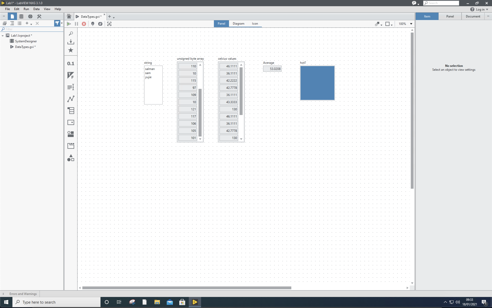
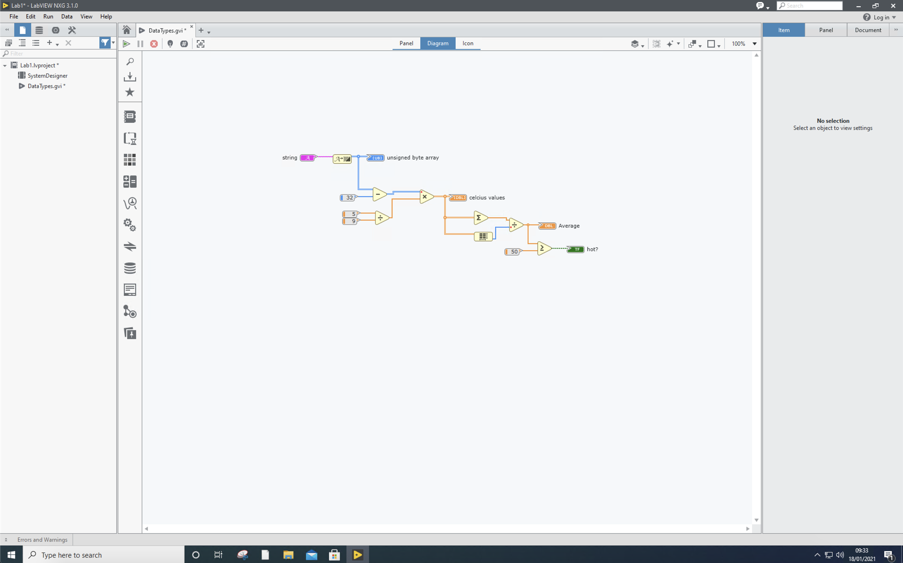
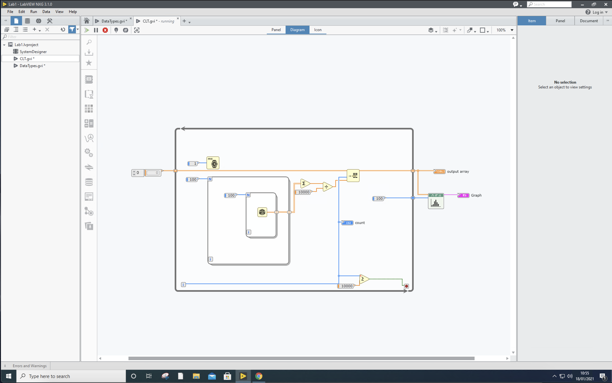
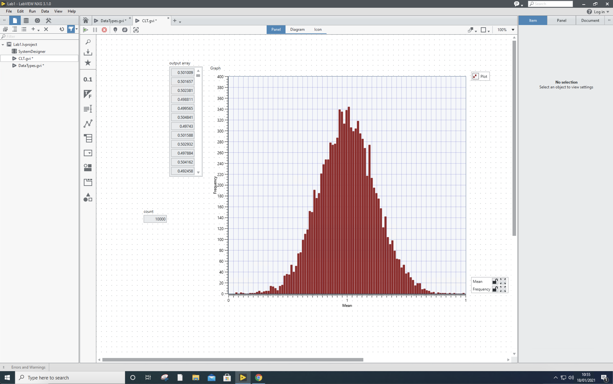
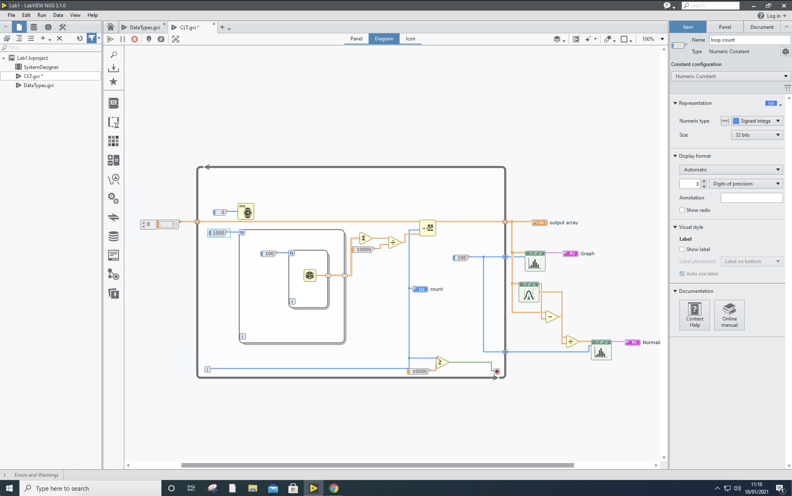
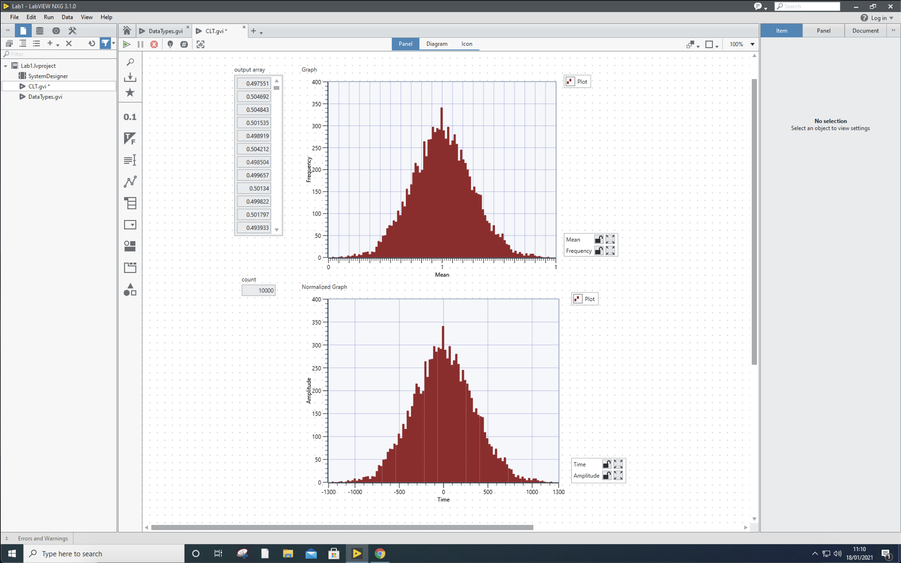

## Exercise 1

##### Task 1

> Input your surname on "input string" field and retrieve the integer representation of its first three characters within a single execution of the program. Copy (take a screenshot) the block diagram and the front panel of your code, and include them in your logbook

## Exercise 2

##### Task 1 & 2

> Include the block diagram and the front panel in your logbook.
>
> Create a control for stopping the execution of the program after 1000 iterations. Set the value of "number of bins" to 10. Include the corresponding histogram in your logbook. 

##### Task 3

> Revise your code such that the final distribution you observe in the histogram is a standard Normal distribution (i.e., it has zero mean and unit variance). Include the revised block diagram in your logbook, and explain each of the changes you have made.

The standardised histogram is achieved by
$$
Z=\frac{X-\mu}{\sigma}
$$

